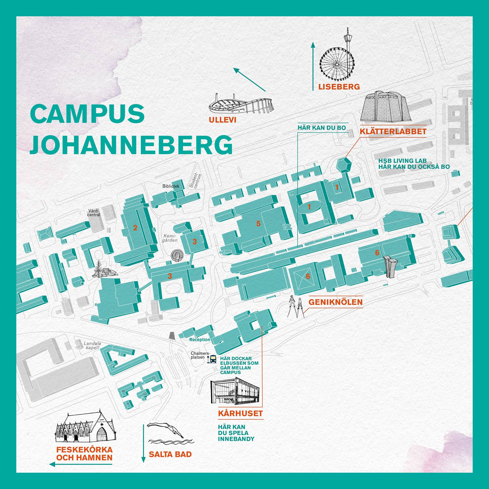
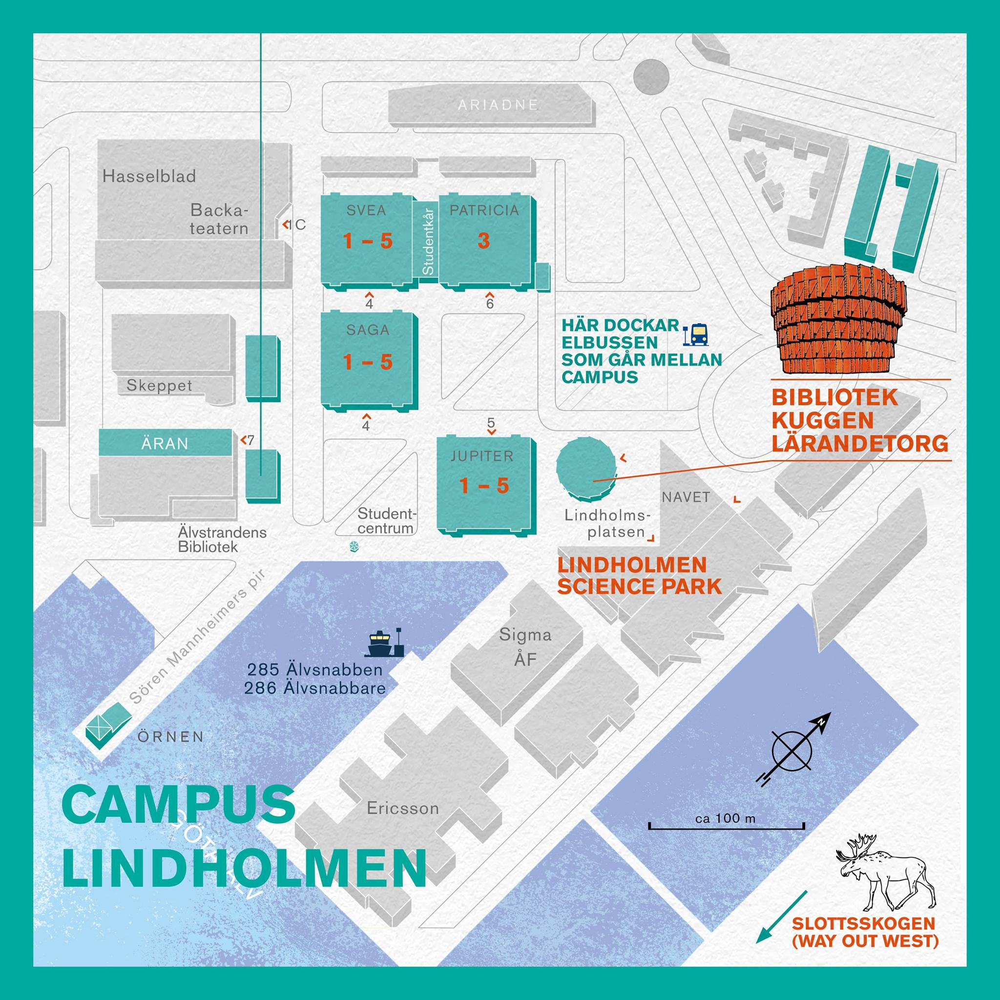
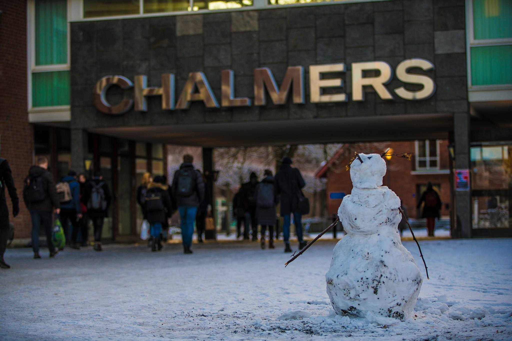
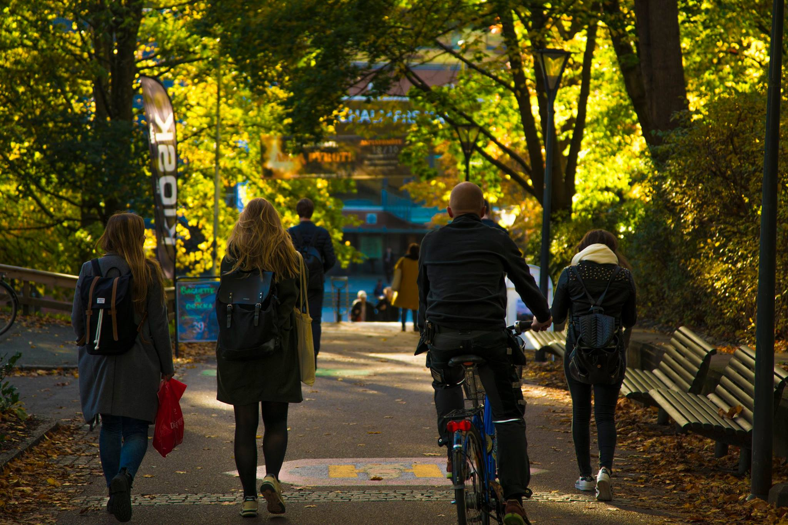

> Life is not about waiting for the storm to pass but learning to dance in the rain.  - Vivian Greene

## Introduction

It will takes you around 13 minutes to read through this blog.

Dear reader, if you would like to get some practical tips for the application season, you can skip to the *Application Advice* section. The structure of this blog is illustrated in the following mind map.

### An unplanned encounter

At the end of November 2023, I was researching information about power amplifiers(PAs) in my slightly chilly bedroom. My bachelor thesis is about PAs. Initially, it went smoothly, but I encountered some difficulties in understanding the intermodulation distortion(IMD) behaviour in PAs while studying. The explanations provided in the textbooks are not clear enough.

Fortunately, I found this [article](https://ieeexplore.ieee.org/document/1261285) written by *Prof. Christian Fager* from Chalmers University of Technology. In this article, the formulas, text, and images complement each other well, and the language is clear and concise. This allowed me to grasp the content of this section in a short time. This was an unplanned encounter with Chalmers as a reader. When I was writing this blog, I happened to find my notes of the PA circuit diagrams from this excellent article.

At that time, I had already made the decision to pursue a Master's degree abroad. So I typed *Chalmers* into Google. A few days later, I put *Chalmers* into my list of applications.

### Introduction to myself

My name is Laurent. I completed my undergraduate studies at Southeast University, China, in 2024. My undergraduate major was *Communication Engineering*, and I am currently going to pursue a master's degree in *Information and Communication Technology*(ICT) at Chalmers University of Technology.

I enjoy reading, with *Alice Munro* as my favourite author. I also love listening to music, and *Led Zeppelin* is always my top choice. Watching a film is also a must for me. *Stanley Kubrick* is my most admired director. My beloved anime character is *Rei Ayanami* from *Neon Genesis Evangelion*, which is why I use her as my avatar.

### Purpose of this blog

This blog is a sample designed to showcase blogging techniques. Although this is actually my first official blog post, I have done my best to make it as good as possible.

As a reader, my friend, I will focus on sharing the following aspects with you:

- Chalmers University of Technology in my eyes
- My personal motivation to apply for this ICT program in Chalmers
- Some useful *Application advice* for every applicant
- Some interesting stories in my application season

## About Chalmers

In this section, I will briefly introduce Chalmers, focusing on its academic strengths and industrial spirit. The information is primarily sourced from the [official website](https://www.chalmers.se/) and the corresponding [wikipedia page](https://en.wikipedia.org/wiki/Chalmers_University_of_Technology).

### Overview

**Chalmers University of Technology** is a private research university located in Gothenburg, Sweden, ranking among the world's top 100 universities in engineering and technology. Chalmers is a member of the IDEA League network, Nordic Five Tech network, ENHANCE and CESAER. Chalmers has strong partnerships with major industries such as Ericsson, Volve and Saab AB. The current president of Chalmers is *Martin Nilsson Jacobi*.

The learning atmosphere is open-minded , encouraging independent thinking and creativity.

Here are some picture I collected from the [facebook profile](https://www.facebook.com/chalmersuniversityoftechnology) of Chalmers, in which I can feel the openness and inclusivity, as well as the design imbued with a strong scientific and engineering spirit on campus.

### Academic Strengths

You can get the full introduction of Chalmers' Reputation and ranking in this [page](https://www.chalmers.se/en/about-chalmers/key-facts-about-chalmers/reputation-and-ranking/).

Chalmers ranked 139 in the newest *QS World University Rankings*. I personally believe that QS rankings should only be used as a reference and not followed blindly. In Sweden, Chalmers has had the highest reputation. Chalmers are famous in Sweden from both an educational and research perspective.  

Chalmers has 13 reputed department:

- Architecture and Civil Engineering
- Computer Science and Engineering
- Electrical Engineering
- Physics
- Industrial and Materials Science
- Chemistry and Chemical Engineering
- Life Sciences
- Mathematical Sciences
- Mechanics and Maritime Sciences
- Microtechnology and Nanoscience
- Space, Earth and Environment
- Technology Management and Economics
- Communication and Learning in Science

As you can see, these departments are comprehensive, covering both traditional and modern scientific and engineering disciplines. The integration of these fields is increasingly reflected in the vision for a sustainable future.

### Industrial Spirit

If you search for examples of Chalmers' collaborations with the industry, you will find many inspiring results. The cases presented on the [Chalmers Industriteknik website](https://chalmersindustriteknik.se/) effectively support my point.

Chalmers Industriteknik(CIT) focuses on *bringing research from the academy to industry*. The webpage lists five main areas of collaboration, including *Applied AI*, *Circular Economy*, *Energy*, *Innovation management* and *Materials*.

For example, under the Applied AI branch in Computer Vision, you can find a series of ongoing university-industry collaboration projects, such as [Develop and validate AI in existing patient processes for skin cancer](https://chalmersindustriteknik.se/en/project/develop-and-validate-ai-in-existing-patient-processes-for-skin-cancer/) and [Increased recycling in Second Hand through sorting with the help of AI](https://chalmersindustriteknik.se/en/project/increased-recycling-in-second-hand-through-sorting-with-the-help-of-ai/). These projects are practical and can be applied in the industry to benefit people, indicating the industrial spirit rooted in Chalmers.

I think this is probably the dream of every engineer: the results of their hard work and research making a tangible impact on social development and technological progress.

## Why Chalmers

When it comes to this important question *Why Chalmers*, I believe you have found some reasons from my content above. Let me dive into this question and give you more perspectives.

### Official description

From this official page [Why Chalmers](https://www.chalmers.se/en/education/study-at-chalmers/why-chalmers/), two aspects of reasoning are provided, namely *education* and *beyond education*.

*As for education, all the feedback I received about the quality of education at Chalmers during the application season was almost uniformly positive.

There are many keywords associated with Chalmers' education, such as innovation, independent thinking, teamwork, high standards, diversity, and comprehensive development, while the most attracting sentence in the official description is

> We have great connections with the industry and encourage our students to get a glimpse of “the real world” and network before graduating.

Getting into *the real world* is necessary but hard. The goals pursued by industry and academia are often contradictory, to the extent that researchers immersed in academia may sometimes prioritize performance over feasibility.

*Beyond education* means "more than education", which is harder to achieve than *education* itself. After all, while the world is fundamentally constrained by physical laws, it cannot be mechanically deduced into a complete picture through calculations alone.

Grasp every opportunities and put a valuable idea into reality. It takes more than just textbooks and codes.

### Personal motivation

The core factor that ultimately led me to choose Chalmers was **its pursuit of high standards in the curriculum and teaching quality of its ICT programs**.

My favourite subjects include *Communication Principles* and *Microwave Engineering*. I still remember that I tried to create a clear and organized mind map for reviewing for the communication principles exam (see below).

After my undergraduate studies, I realized I have a deep interest in the field of communication, and Chalmers' presence has precisely filled the gap in my confidence about pursuing both academic and industrial careers after graduation. You can find the introduction of ICT programme plan in this [page](https://www.chalmers.se/en/education/find-masters-programme/information-and-communication-technology-msc/#programme-plan).

What's more, I really like Sweden. It is located in Nordic, offers a great work-life balance, and has a highly advanced and developed industrial culture. My personality also aligns well with the Swedish cultural pursuit of *Lägon*, which implies something that is fitting or just right for a particular situation.

## Application advice

My advice on applications might not be very specific, as I don't plan to recommend specific schools. Instead, I want to provide suggestions based on my personal experiences, from an epistemological perspective.

### Action speaks louder

This advice seems obvious, if you say so. However, if you are a Chinese student, you will likely face conflicting pressures from various directions, such as job hunting, graduate school exams, and guaranteed recommendation for graduate school, as well as the uncertainty associated with studying abroad.

Reality can be heavy but also vibrant. Studying abroad means you'll need to invest time in meeting language exam standards, writing CV and motivation letters, keeping up with various information sources, and missing no key date deadlines.

All of this is based on the premise that once you make a decision, you take concrete action. In fact, many of my friends who initially intended to study abroad ended up giving up due to the lengthy preparation process and the uncertainty of being accepted.

More people actually hesitate during the long period of contemplation—hesitation is the enemy of action.

### Make a list

In fact, the complexity of application documents can often be managed with a clear checklist.

For example, if you want to apply for the Master of ICT programme in Chalmers, you just need this list, according to this [page](https://www.universityadmissions.se/intl/search?period=21&freeText=CTH-90009).

- [x] **Certificates** and diplomas of your completed degree(s)
- [x] **Transcripts** of completed courses and grades for each semester included in your degree
- [x] Proof of **English language proficiency**
- [x] Proof that you **meet the specific entry requirements**/Course Description
- [x] **Copy of the page in your passport**
- [x] Your **CV** including a **referee**
- [x] **Motivation Letter**
- [x] **Recommendation Letter**

It's not very hard to prepare every single document. All you need to do is to clearly allocate time in order to prepare or request each document from the school. The application system in Sweden is quite clear and straightforward.

### Keep calm

Lastly, regarding mindset, I believe that choosing to study abroad inevitably means embarking on a solitary path, and anxiously awaiting admission notifications is also part of the scenery on this lonely journey.

You are not alone. These days, I feel that the greatest potential in life is found in moments of calm solitude. Calmness comes partly from the comprehensive abilities reflected in your resume, including GPA, project experience, and essays, and partly from choosing how to handle pressure. An appropriate way to think might be: Anxiety doesn’t bring real benefits; it's better to focus on doing the current tasks well.

## Interesting stories

Dear reader, if you've made it this far through the blog, consider this content a special bonus for you. Relax and listen to a few stories.

### With my parents

- My parents always mix up Switzerland and Sweden because their names in Chinese are both two characters long, and the first character is the same. I once tried really hard to explain the differences between these two countries, but in the end, it came out to be a failure.
- Although my parents didn’t really grasp the concept of studying abroad for a master’s degree, they supported me unconditionally. Their only source of information was a few charmless study-abroad bloggers, but that didn’t deter them. Once, when I jokingly mentioned that it might be a long time before I return home, they joked back, saying, "Just remember to come back and pay for our retirement home!"

### With my instructor

- Once, while I was returning an FPGA development board to the classroom during my advisor's lecture, I mentioned that I was planning to study at Chalmers. With a mysterious smile, my advisor said, "Congratulations! Are you ready to embark on an unknown adventure abroad?" It sounded just like a village elder describing an unknown land to a brave adventurer setting out on a quest.
- During my thesis project, my advisor revised my paper several times and checked my presentation slides in detail. While I was in my dorm room checking my code and debugging, I would often find myself inexplicably imagining my advisor’s handsome and refined face appearing before me.

### With my senior

- While collaborating with a senior on a paper, it happened to us that one of the articles we were referencing was authored by a professor from Chalmers. Without missing a beat, he promptly assigned me the task of organizing and summarizing that article.
- During my senior year, working part-time with a senior at a café while discussing future plans and research topics created some of my most unforgettable memories.
