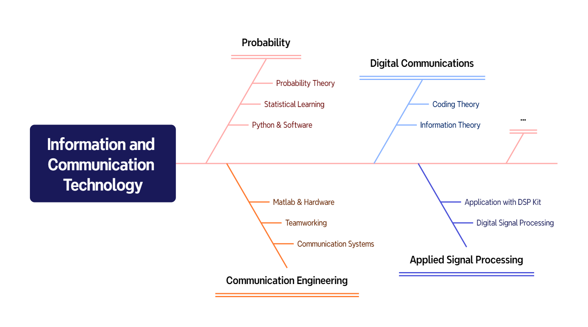
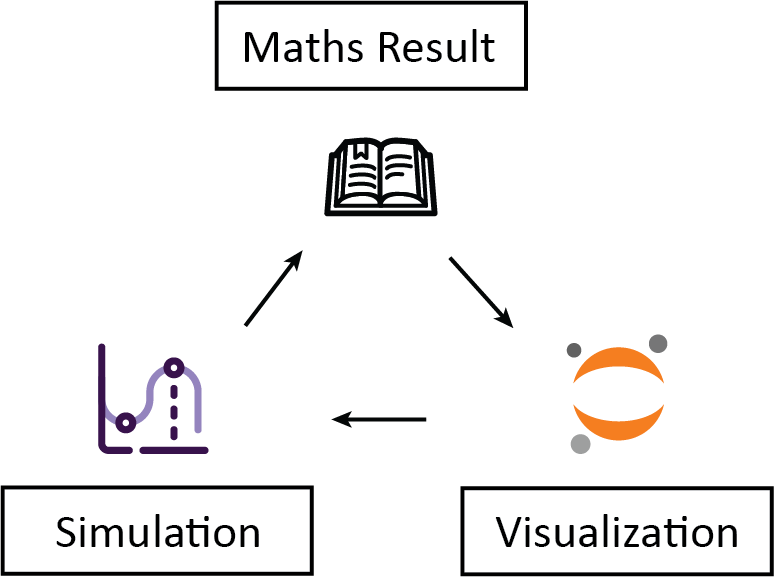
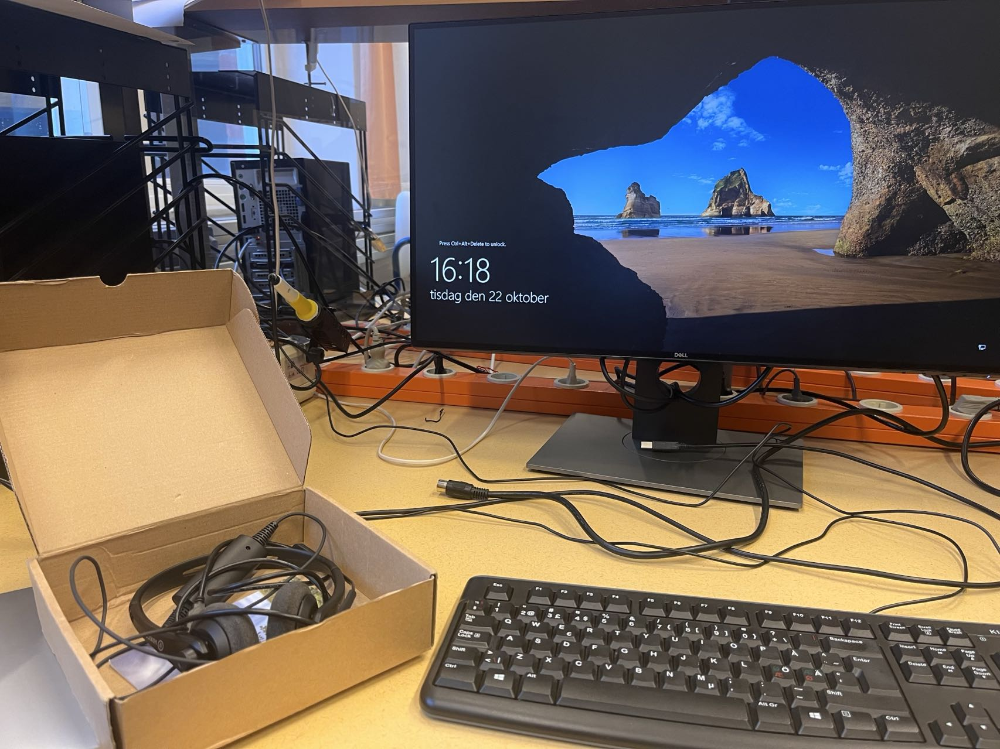
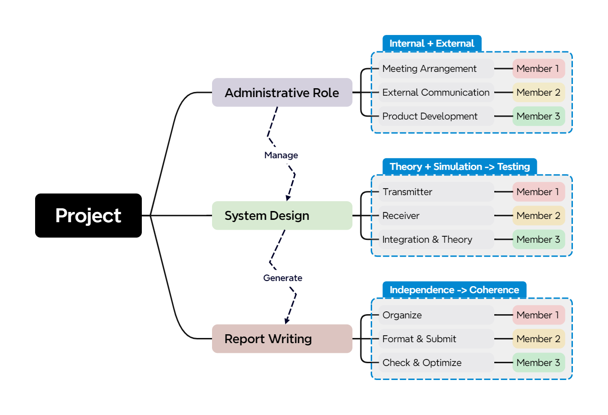

(This is a repost of the original blog. Check the original blog with this [link](https://link.unibuddy.co/unibuddy/Fx5PQXDoQ7Ev1xddA))

As an engineering student, my experience at Chalmers has been profoundly enriched by its well-organized project-based curriculum and its emphasis on blending theoretical knowledge with practical applications. This blend has allowed me to achieve a deeper level of understanding and satisfaction; there is nothing quite like the moment when a theory comes to life through coding or hardware design, bringing with it both joy and insight. This blog will share my experiences in the Master Programme in Information and Communication Technology (MPICT) at Chalmers. If you are considering a programme at Chalmers, especially within the engineering sciences, this may serve as a helpful guide.

## Master Plan & Course

Hello everyone! My name is Jun Cao, one of the Content Ambassadors at Chalmers this year. Here’s a brief overview of this blog’s structure—feel free to jump to any section that interests you.

For detailed information on my programme at Chalmers, you can visit this [website](https://www.chalmers.se/en/education/find-masters-programme/information-and-communication-technology-msc/). I won’t repeat the information listed there; instead, I’ll share my insights on the programme’s structure and my experiences so far.

### Structure & Why I think it is excellent

In my undergraduate studies, communication systems courses were often heavily theoretical with limited practical application—a common issue in some programme plans. If you have a background in Electrical Engineering and Computer Science (EECS), you may have asked yourself questions like: *Why am I studying this course? How do different courses connect? And how are various disciplines linked?*

Of course, no programme plan is perfect, so why do I believe that Chalmers' approach is particularly effective? The core courses here include *Introduction to Communication Engineering* and *Digital Communications*. Key areas in this field, such as signal processing and communication network, are also integrated into the curriculum, alongside vital courses in statistics, machine learning, and other relevant topics.

Chalmers’ course structure carefully considers the sequencing of prerequisite and subsequent courses. In the first term, students take [Probability and Statistical Learning using Python](https://www.chalmers.se/en/education/your-studies/find-course-and-programme-syllabi/course-syllabus/MVE137/), which covers foundational concepts in communication and introduces basics in statistical learning and optimization. Additionally, the [Introduction to Communication Engineering](https://www.chalmers.se/en/education/your-studies/find-course-and-programme-syllabi/course-syllabus/SSY121/) course provides a solid theoretical foundation and teaches students to approach problems from an engineering perspective. With these courses as a base, the required follow-up course in [Digital Communications](https://www.chalmers.se/en/education/your-studies/find-course-and-programme-syllabi/course-syllabus/SSY125/) becomes much more manageable.

In contrast, [Applied Signal Processing](https://www.chalmers.se/en/education/your-studies/find-course-and-programme-syllabi/course-syllabus/SSY130/) and [Introduction to Communication Networks](https://www.chalmers.se/en/education/your-studies/find-course-and-programme-syllabi/course-syllabus/EEN115/) represent two major branches in the field of communication. The former focuses more on practical applications, while the latter emphasizes theoretical research.

These required courses are supplemented by a flexible selection of electives. Beyond the recommended electives listed in the curriculum, students can theoretically choose any course offered by the university, including [Track Courses](https://www.chalmers.se/en/education/your-studies/course-selection-and-registration/select-courses/choose-a-tracks-course/)—interdisciplinary courses designed to address current trends. Electives in communication often intersect with areas such as microwave engineering, digital systems design, and machine learning, which overlap with other Chalmers programmes. This cross-disciplinary classroom environment means it is common to learn alongside peers from different academic backgrounds—a uniquely exciting opportunity, as you can often gain insights from fields outside your own.

For example, I personally learned control system theory techniques from classmates in the [Mobility Engineering](https://www.chalmers.se/en/education/find-masters-programme/mobility-engineering-msc/), fundamental digital systems design concepts from peers in [Embedded Electronics System Design](https://www.chalmers.se/en/education/find-masters-programme/embedded-electronic-system-design-msc/), and methods for optimizing models using deep neural networks from students in [Data Science and AI](https://www.chalmers.se/en/education/find-masters-programme/data-science-and-ai-msc/). These insights, sparked by interdisciplinary exchange, are ideas that only emerge through cross-field collaboration.

### My Experience in Study Period 1

When I first arrived at Chalmers, the two courses I took in the first period, which lasts about two months, left a strong impression on me.

The first course was [Probability and Statistical Learning using Python](https://www.chalmers.se/en/education/your-studies/find-course-and-programme-syllabi/course-syllabus/MVE137/), which I will refer to as the *Probability* course in the following text, taught by two full professors (Giuseppe and Alexandre) from the Chalmers Department of Communication Systems. The course covers topics in probability theory, stochastic processes, and statistical learning, with weekly Python exercises to reinforce the material. The final assessment is divided according to the course content: the probability theory portion is evaluated through an exam, while statistical learning is assessed through a Python project. This balanced workload and assessment approach makes passing achievable while providing appropriate evaluation methods for each topic. Both theoretical understanding and practical skills are sharpened.

I particularly enjoyed Giuseppe’s (one of the lecturers) clear and engaging explanations of fundamental probability concepts. He used simple models (like coin flipping and birthdays paradox problem) to provide deep insights—no overwhelming math, just vivid examples to anchor the ideas in our minds. Alexandre, on the other hand, used an intuitive, step-by-step approach to introduce us to the wonders of statistical learning, reminding us that *there is no free lunch*: you always trade something to gain what you value most. This concept felt like a life philosophy.

The second course, [Introduction to Communication Engineering](https://www.chalmers.se/en/education/your-studies/find-course-and-programme-syllabi/course-syllabus/SSY121/), which I will refer to as the *Communication Engineering* course in the following text, was guided by the head professor Fredrik of Chalmers' Communication Systems department. This course introduced the mathematical foundations of basic communication systems, centred around the matched filter approach, and provided concise explanations of other topics like Wi-Fi, OFDM, and MIMO technology. Assessments consisted of both a project and an exam.

To be honest, this is not an easy course to teach: it requires both engineering thinking and mathematical understanding. However, Fredrik’s lectures struck a fine balance between engineering applications and theoretical concepts. The lectures, combined with exercises, labs, and projects, all complemented each other effectively.

In a broader sense, during my first two courses, *Probability* course provided a mathematical perspective on probability theory and statistical learning for understanding the underlying principles of communication. *Communication Engineering* course gave an engineering perspective on communication, showing us the practical architecture of a mathematical framework so that we would not get lost in complex derivations.

## Theory & Practice

I have always believed that the essence of engineering lies in combining theory and practice: practice drives the development of theory, while theory provides the foundation for practice. Specifically, whenever I learn a new concept, my instinct is to *see if I can simulate it* or *observe its effects in a real-world scenario*. Fortunately, the two courses I took in this period met these needs perfectly.

### **Lab & Project**

In the *Probability* course, the professors made extensive use of Jupyter Notebook to visually demonstrate mathematical theories in class. All our assignments were submitted through Jupyter Notebook, where we used code simulations to validate theoretical solutions. This continual cycle of "mathematical result – visualization – simulation" significantly deepened my understanding. Probability theory and statistical learning no longer feel like distant or difficult fields to apply; instead, I now have a much stronger grasp of how to use them in practice.

The project for *Communication Engineering* course involved designing a communication system. The technical requirements were straightforward and stayed well within the scope of what we had learned in class; the challenge was to write each line of code clearly and thoroughly understand the theoretical details behind it. What left an impression on me was that, after completing the project through teamwork, I could look back at each technical barrier we overcame. I can still picture the discussions with professors and teaching assistants, the moments we spent testing in the lab, and our weekly team meetings.

I remember our team encountering a strange issue during testing: no matter how we adjusted the parameters, the received signal’s bit error rate and constellation diagram looked poor. After a long troubleshooting process, we finally discovered the problem—it turned out we had forgotten to upload a basic filter function in the lab.

In designing the system, we were inspired by the instructor’s teaching and decided to adopt a bottom-up approach—starting with the design and testing of individual modules, followed by assembly and overall testing. This mirrors the typical approach in real-world engineering projects.

### Teamwork Skills

Have you ever genuinely participated in or organized a team collaboration in the role of simulating product development? After working on a project in *Communication Engineering* course, my understanding of teamwork has reached a new level: teamwork is not about just achieving a goal—it also involves communicating with managers, responding to customer feedback, calculating costs and work hours, and breaking down the technical framework for easier task division.

Based on these objectives, our team’s role allocation framework was as follows (for explanatory purposes only):

Under this well-organized and efficient collaboration model, our team's productivity improved—we even achieved our goals in much less time than expected. This suggests that in a real-world corporate setting, there may be cases where development costs and expected efforts are initially overestimated.

If I were to choose the biggest takeaway from the first period of the course, it would be the perspective and skills in teamwork that the *Communication Engineering* project provided me.

### An Old Saying from China

There is an old Chinese saying: *纸上得来终觉浅，绝知此事要躬行* (Pinyin: Zhǐ shàng dé lái zhōng jué qiǎn, jué zhī cǐ shì yào gōng xíng). A translation could be: *"What is learned from books is shallow; true understanding comes from practice."* This saying originates from a poem written by the ancient Chinese poet Lu You, which he composed in his later years to guide his son, Ziyu. The central message is not to dismiss the value of learning from books, but rather to emphasize that if one seeks a deeper, more essential understanding of knowledge, practice is an indispensable path.

This saying perfectly encapsulates my overall impression of the courses, which I believe aligns with the course designers' goal of cultivating students' practical abilities. From what I have shared, you can already see the broad range of skills developed through practical experience.

These include visualizing and simulating theoretical knowledge, designing communication systems, as well as training in corporate management and teamwork
